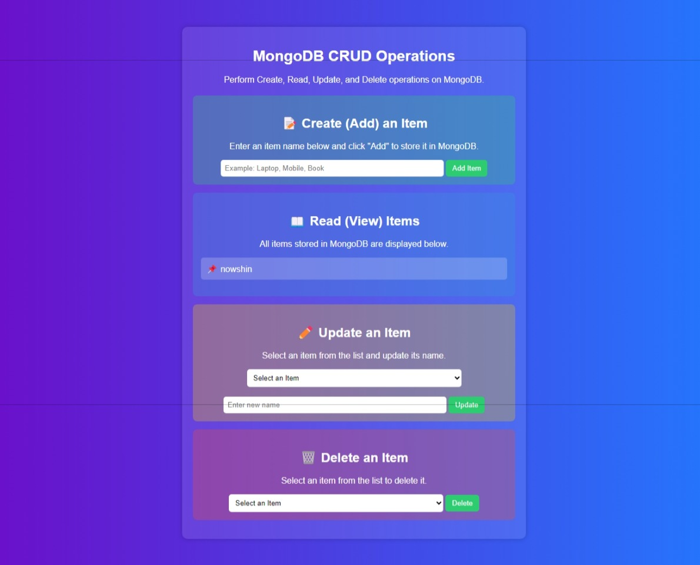

# 🚀 CRUD Operation Using MongoDB

## 📁 Project Structure
```
Crud_operation/
│-- frontend/
|---------- index.html
|---------- styles.css
|---------- script.js
│-- backend/
|------ /nodemodules
|------ server.js
|------ /modules/
|-------- item.js
|------ package.json
|------ package-lock.json
```

## 🔧 Backend Setup
1. Navigate to the `backend` folder and initialize a Node.js project:
   ```sh
   npm install
   ```
2. Install required dependencies:
   ```sh
   npm install express mongoose cors body-parser
   ```
3. Verify that all modules are installed:
   ```sh
   npm init -y
   npm list --depth=0
   ```

## 🚀 Running the Backend Server
To start the backend server, navigate to the `backend` folder and run:
```sh
node server.js
```
If successful, it will display:
```
✅ Localhost running on PORT
✅ MongoDB connected
```

## 🎨 Frontend Setup
You can launch the frontend in two ways:
1. Using **Live Server** in VS Code (Recommended)
2. Using Python's built-in HTTP server:
   ```sh
   cd frontend
   python -m http.server 5500
   ```

🎉 Your CRUD application is now up and running! 🚀

## 📸 Output Screenshots

### ✅ Backend Running Successfully


### 🎨 Frontend Interface


